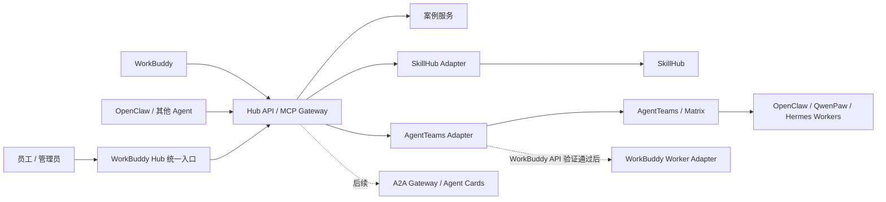
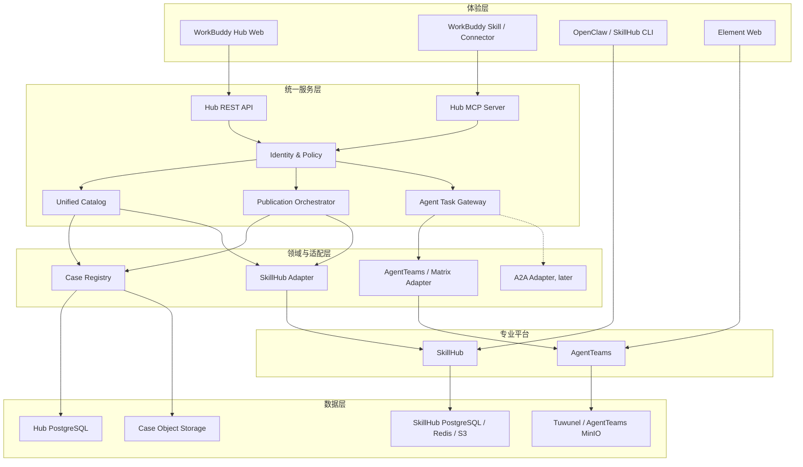
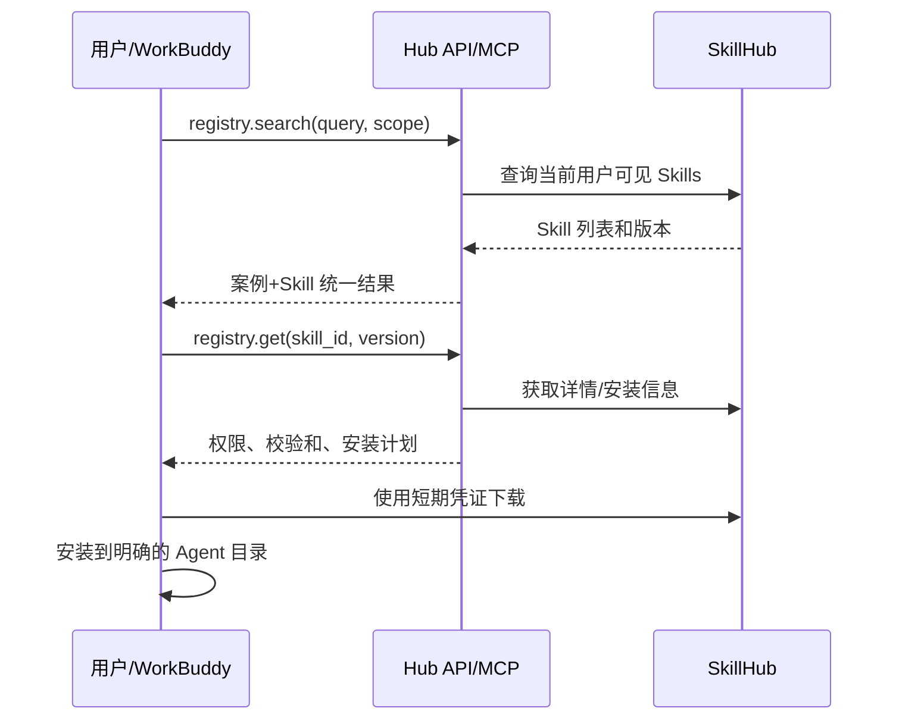
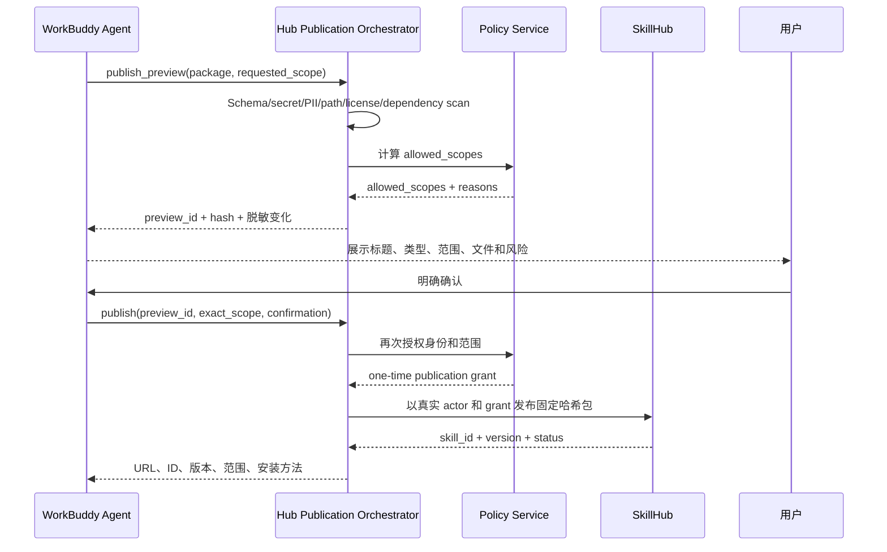

# WorkBuddy Hub + SkillHub + AgentTeams 整体架构与开发落地方案

> 版本：v1.0
> 日期：2026-08-08
> 状态：架构基线 + Hub API PoC 已验证，进入上游平台接入评审
> 输入需求：`加入skillhub 和 加入agent交流平台.txt`

## 1. 执行结论

本次迭代不应把 SkillHub 和 AgentTeams 的页面简单挂到现有站点，也不应让三套系统直接共享数据库。推荐采用“一个统一入口、两个专业平台、一层受控适配”的组合架构：

1. **WorkBuddy Hub 继续作为用户唯一入口和产品外壳**，保留现有学习中心、案例社区和贡献入口。
2. **iflytek/skillhub 作为 Skill 的权威注册表**，负责 Skill 包、版本、命名空间、下载、评分、治理和审计，不重复自研这些能力。
3. **AgentTeams 作为多 Agent 协作运行时**，负责 Matrix 房间、Manager/Worker 编排、共享文件、可观察的 Agent 对话和人工介入。
4. **新增 WorkBuddy Hub API / Integration Service**，对前端和 WorkBuddy 暴露稳定的 REST/MCP 契约，向后适配 SkillHub 与 AgentTeams，避免上游接口或版本直接渗透到现有站点。
5. **WorkBuddy 不能暂定为 AgentTeams 原生 Worker**。当前核验到的 AgentTeams 原生运行时是 OpenClaw、QwenPaw 和 Hermes，没有 WorkBuddy。必须先完成 WorkBuddy 可编程调用能力验证，再决定采用完整 Worker Adapter，还是仅提供 WorkBuddy 主动进入协作房间的 MCP/Connector 模式。
6. **A2A 不作为一期内部消息总线**。AgentTeams 已使用 Matrix；A2A 应作为后续跨平台 Agent 的标准边界，通过 Agent Gateway 暴露 Agent Card 和任务接口，而不是替换 Matrix。

最终产品关系如下：



### 当前落地状态（2026-08-08）

- **已完成 Hub PoC**：案例目录、`registry.json -> SQLite/PostgreSQL` 种子导入、Alembic 基线迁移及旧 PoC 数据库收编、发布预览/确认/审计、案例版本更新/报告/评分/回滚、案例 + SkillHub 统一搜索投影、Skill 详情和固定版本安装计划。
- **已完成适配边界**：SkillHub 搜索/详情/resolve/下载重定向和 Trusted Publication Grant 客户端；AgentTeams 拆分为 Controller Team client 与 Matrix client，任务、消息、增量事件和取消请求均走 Matrix，不调用不存在的 Controller Task API；Hub 已提供 JSON-RPC MCP 入口，工具调用复用 REST 授权、审计和适配器；上游未配置时返回明确错误。
- **已完成门户入口**：现有案例页支持 API 灰度和静态回退；新增 Skill 中心和 Agent 协作室；Nginx 示例、MCP/OpenAPI/Event Schema 与 PoC 启停回滚 Runbook 已写入仓库。
- **已完成本地恢复链路验证**：Hub PostgreSQL 可生成带 SHA-256、Alembic 版本和表行数清单的 custom-format 备份，并在隔离临时数据库和临时 Hub 容器中完成端到端 smoke；生产加密存储、保留期、RPO/RTO 和季度恢复演练仍未验收。
- **已完成本地供应链门禁**：`uv.lock` 可重复导出带哈希的生产依赖锁，镜像使用固定 Alpine digest、binary-only 安装并移除运行时 `pip`；固定版本的 `pip-audit`、Trivy 和 CycloneDX 生成已实跑，最终 46 个依赖和镜像均为 0 漏洞、例外 0。GitHub Runner、制品签名/来源证明、多架构和生产准入仍待验收。
- **已验证**：本地自动化测试覆盖 OIDC RSA/JWKS 验签、`sub`/部门授权、预览与发布结果幂等、发布 Manifest 安全规则、固定上游 SkillHub 与 AgentTeams 契约；全新数据库、旧 PoC 数据库收编和 `0001 -> 0005` 保数据迁移通过；浏览器桌面与移动端布局、交互和控制台通过；4 个既有案例可读，兼容 ID `case-capacity` 和标题 `项目资料交付检查` 保持不变。
- **架构决策已冻结**：根据当前仓库和已核验资料，ADR-006 一期采用主动协作 Connector；没有 headless/API 证据，不实现或宣传自治 Worker。后续取得厂商接口证据后再重新评审。
- **尚未完成**：真实 SkillHub/AgentTeams 实例部署与契约烟测、组织 IdP/Claim/撤权时限与 Namespace 同步验收、SkillHub 服务端 TrustedPublicationGrant 扩展、Matrix 文件权限演练，以及生产前端的登录态注入。未完成项不得在页面或交付说明中写成“已支持”。

## 2. 当前项目基线

### 2.1 已有能力

当前 `workbuddy-hub` 不是空白项目，已经形成了本次架构需要延续的产品骨架：

| 当前资产 | 已有能力 | 本次处理 |
|---|---|---|
| `workbuddy-hub/index.html` | 学习入口、课程、岗位路径、案例预览 | 保留，升级为统一门户 |
| `workbuddy-hub/community/` | 案例搜索、列表和详情 | 保留案例领域，后端化 |
| `workbuddy-hub/data/registry.json` | 4 个静态示范案例 | 迁移到案例数据库；迁移期保留静态回退 |
| `workbuddy-hub/contribute/` | 成功后贡献、脱敏预览、范围确认 | 升级为真实发布流程 |
| `workbuddy-hub/agent-skill/` | WorkBuddy 发布助手、JSON Schema、REST/MCP 契约 | 作为 Agent 侧契约基线，版本化 |
| `workbuddy-hub/docs/api-contract.md` | search/get/preview/publish/update/rate/report/rollback | 由 Hub API 实现并作为稳定外部契约 |
| `serve.py` | 本地静态服务与 MP4 Range | 仅用于本地预览，不承担生产 API |
| Nginx `/var/www/workbuddy` | 当前生产静态站点 | 继续承载静态门户，新增反向代理入口 |

现有项目已经确立的产品原则必须保留：

- Agent 不能替用户扩大个人、部门、组织发布范围；
- 发布前必须有脱敏预览和用户明确确认；
- UI 确认不等于权限，服务端必须再次授权；
- 案例和 Skill 都要说明输入、输出、限制、验收标准和人工复核点；
- 不用虚构评分、热度或排名；
- 采用发布后治理、下架和回滚，不设置编辑性质的事前人工审核。

### 2.2 当前缺口

| 领域 | 当前状态 | 缺口 |
|---|---|---|
| 身份 | 静态匿名站点 | 缺少登录、组织、部门和权限上下文 |
| 案例 | JSON 文件 | 缺少服务端查询、版本、范围、审计和治理 |
| Skill | 只有空数组和发布规范 | 缺少注册表、包存储、安装、版本和真实发布 |
| Agent 协作 | 只有介绍内容 | 缺少房间、任务、消息、状态、文件和人工介入 |
| WorkBuddy 接入 | 指导 Agent 读取本地 `SKILL.md` | 缺少认证 Connector/MCP 服务和双向协作适配器 |
| 运维 | 静态 Nginx 同步 | 缺少容器编排、数据库、对象存储、监控、备份和灰度 |

## 3. 候选上游核验与采用边界

本方案基于 2026-08-08 对上游主分支的只读核验：

| 项目 | 核验版本 | 可直接复用 | 不能直接假设 |
|---|---|---|---|
| `iflytek/skillhub` | commit `460304e` | `SKILL.md` 包、语义版本、PRIVATE/NAMESPACE_ONLY/PUBLIC、团队命名空间、ClawHub 兼容 API、CLI、PostgreSQL/Redis/S3、审计和治理 | 它不是案例库；默认发布审核流与本项目“无事前人工审核”不一致；不能直接把组织内部内容映射为匿名可下载的 global PUBLIC |
| `agentscope-ai/AgentTeams` | commit `90f861c` | Matrix/Tuwunel、Element、Manager/Workers、Higress、MinIO、人工介入、OpenClaw/QwenPaw/Hermes、Docker/Kubernetes 部署 | 没有核验到 WorkBuddy 原生 Worker；不能声称 WorkBuddy 已可直接加入并自主收发任务 |
| `a2aproject/A2A` | commit `19598c4` | Agent Card、JSON-RPC 2.0、HTTP/SSE、长任务、结构化数据和文件引用 | 不是群聊产品，也不应取代 AgentTeams 内部 Matrix 通道 |

因此：

- **SkillHub：采用，但通过 Adapter 接入；不把现有案例强塞进 SkillHub。**
- **AgentTeams：采用为独立协作产品；WorkBuddy 通过验证后的 Bridge 接入。**
- **A2A：预留协议边界，不列入一期关键路径。**

## 4. 目标产品架构

### 4.1 用户入口

WorkBuddy Hub 首页形成五个一级入口：

1. **学习中心**：课程、路径、工具指南；
2. **案例库**：业务场景、输入、步骤、样例、验收；
3. **Skill 中心**：搜索、详情、版本、安装、更新和发布；
4. **Agent 协作室**：进入 AgentTeams，查看本人可访问的 Team/Room；
5. **贡献**：从成功任务生成案例或 Skill 的脱敏预览并发布。

“案例”和“Skill”在搜索体验上统一，在生命周期和存储上分开：

- 案例强调业务场景、样例、提示词、检查标准；
- Skill 强调稳定触发、工具权限、确定性流程、输出契约；
- `case+skill` 必须发布为两个有独立 ID 和版本的对象，通过 `links` 关联。

### 4.2 逻辑分层



### 4.3 组件职责

#### WorkBuddy Hub Web

- 保留现有静态页面结构和视觉语言；
- 通过 OpenAPI 生成的客户端调用 Hub API；
- 登录后显示用户、部门、可发布范围和可访问协作室；
- Skill 详情只展示真实版本、安装量、评分和治理状态；
- AgentTeams 使用独立页面/域名跳转，不通过 iframe 强行嵌入，避免 SSO、CSP、Matrix WebSocket 和移动端问题。

#### Hub API / MCP Gateway

建议新建一个薄服务，初始技术栈采用 **Python 3.12 + FastAPI + Pydantic + SQLAlchemy/Alembic**：

- 与当前项目已有 Python 工具链相容；
- 适合同时提供 REST、SSE、MCP 和后续 A2A Python SDK；
- 只承担统一契约、案例领域、授权编排和适配，不复制 SkillHub 核心能力。

对外稳定契约由 Hub 所有，上游 SkillHub 或 AgentTeams 升级时只修改 Adapter。

#### SkillHub

- Skill 元数据、包文件和版本的唯一事实来源；
- 使用自身 PostgreSQL、Redis 和 S3/MinIO；
- 对 OpenClaw 暴露 ClawHub 兼容 API；
- 对 WorkBuddy Hub 通过原生 REST API 接入；
- 上游镜像固定到明确版本与 digest，不直接跟随 `latest` 上生产。

#### AgentTeams

- Team、Worker、Manager、Human、Room 和消息的唯一事实来源；
- Matrix 消息用于协作可见性，MinIO 用于任务大文件；
- LLM 与外部工具凭据保留在 Higress/Secret 管理层，Worker 不持有真实主凭据；
- Hub 仅缓存任务摘要、Matrix dispatch event ID、与该 Hub ID 明确关联的增量事件，不复制完整聊天记录。

#### WorkBuddy Worker Adapter

Adapter 有两个实现档位，必须由 PoC 结果选择：

| 档位 | 前提 | 能力 | 产品表述 |
|---|---|---|---|
| A. 完整 Worker | WorkBuddy 有受支持的 headless/API/Connector 调用和事件回调 | 接收 Matrix 任务、调用 WorkBuddy、流式回传、取消、文件交换 | WorkBuddy 可作为 AgentTeams Worker |
| B. 主动协作 Connector | WorkBuddy 只能在用户会话中主动调用 MCP/HTTP | 创建任务、发消息、读状态、下载结果，不能被无头唤醒 | WorkBuddy 可接入协作室，但不是自治 Worker |

未完成此验证前，页面文案只能使用“规划接入”或“试验性接入”。

## 5. 统一领域模型

### 5.1 统一索引，不统一底层存储

Hub 维护轻量 `artifact_index`，用于把案例与 Skill 组合搜索：

```text
ArtifactIndex
├─ artifact_id           # Hub 稳定 ID
├─ kind                  # case | skill
├─ provider              # hub-case | skillhub
├─ provider_id
├─ current_version
├─ title / summary / tags
├─ visibility            # personal | department | organization
├─ owner_id / department_id
├─ status                # draft | published | hidden | withdrawn
├─ source_url
└─ indexed_at
```

该表是搜索投影，不是 Skill 内容的第二事实来源。SkillHub 变更通过 webhook（如上游具备）或增量同步任务进入 outbox/index；同步失败不得影响 SkillHub 自身发布结果。

### 5.2 发布范围映射

不要把“组织范围”等同于 SkillHub 匿名全局公开：

| Hub 范围 | SkillHub 映射 | 访问规则 |
|---|---|---|
| `personal` | `PRIVATE` | 仅所有者和治理管理员 |
| `department` | 部门 Team Namespace + `NAMESPACE_ONLY` | 部门成员，成员来自组织身份同步 |
| `organization` | 组织专用 Team Namespace + `NAMESPACE_ONLY` | 所有在职组织成员，必须认证 |
| 互联网公开（未来） | `@global` + `PUBLIC` | 单独权限和流程，不与 `organization` 混用 |

现有 Schema 中 `organization` 与文档中的 `institute` 表述需要在开发前统一为 `organization`；数据库和 API 不保留两个同义枚举。

### 5.3 核心新增表

Hub 自有 PostgreSQL 至少包含：

- `case_artifact`、`case_version`、`case_file`；
- `artifact_index`、`artifact_link`；
- `publication_preview`、`publication_grant`；
- `provider_mapping`；
- `collaboration_task`、`collaboration_event_cursor`；
- `audit_event`、`outbox_event`；
- `idempotency_key`。

所有用户 ID 使用身份平台的稳定字符串 Subject；不把部门名、邮箱或本地自增 ID 当跨系统身份主键。

## 6. 关键业务流程

### 6.1 Skill 搜索和安装



安装必须返回：坐标、固定版本、SHA-256、来源、权限需求、支持的 Agent、安装目录和卸载方法。默认不执行包内脚本；若 Skill 包含可执行脚本，必须额外确认并在受限环境运行。

### 6.2 发布预览与发布



预览必须有内容哈希和短期有效期；内容或范围发生变化后原确认立即失效。发布接口必须支持幂等键，避免 Agent 重试造成重复版本。

### 6.3 SkillHub 审核模型冲突

SkillHub 当前普通用户对 `PUBLIC/NAMESPACE_ONLY` 的发布会进入审核，只有 `SUPER_ADMIN` 可直发；本项目现有规则是“自动验证 + 用户确认 + 服务端授权后发布，事后治理”。推荐方案是：

1. 不向 Hub Adapter 配置通用 `SUPER_ADMIN` Token；
2. 在维护的 SkillHub 集成分支中增加最小化 `TrustedPublicationGrant` 扩展点；
3. Grant 由 Hub Policy Service 签名，包含 `actor_id`、namespace、visibility、package hash、preview ID、过期时间和 nonce；
4. SkillHub 验证 Grant 后以真实 actor 记审计并直达 PUBLISHED；
5. 每个 Namespace 可配置 `post_publish` 或 `pre_publish_review`，当前组织默认 `post_publish`；
6. 上游版本升级必须跑契约测试，确保扩展点未失效。

PoC 可以先使用 SkillHub 原生审核流验证搜索、上传、下载和权限，但不得把 PoC 行为误写成最终产品规则。

### 6.4 Agent 协作任务

Hub 对 WorkBuddy 暴露以下 MCP 工具：

| Tool | Side effect | 作用 |
|---|---|---|
| `collab.teams` | 否 | 查询可访问 Team/Room |
| `collab.create_task` | 是 | 创建有目标、预算、超时和输出契约的协作任务 |
| `collab.send` | 是 | 向指定任务/房间发送消息或文件引用 |
| `collab.status` | 否 | 查询任务状态和最近事件 |
| `collab.wait` | 否 | 通过 SSE/长轮询等待状态变化 |
| `collab.cancel` | 是 | 请求取消并记录操作者 |
| `collab.artifact` | 否 | 获取结果文件的短期下载地址和校验和 |

统一任务状态使用：

```text
created -> queued -> running -> input_required -> completed
                            \-> failed
                  \-> cancel_requested -> cancelled
                  \-> timed_out
```

固定版本 AgentTeams Controller 不存在 Task/Message/Event/Cancel API。Hub 先读取 `GET /api/v1/teams/{name}`，
再使用 Matrix Client-Server API 对上游已创建的房间进行 `whoami`、joined-room 校验、`/sync` 和幂等消息投递。
当前 Team 响应未暴露 coordinator 在 Team Room 中可靠 `@mention` Leader 所需的 Matrix ID，因此一期自动投递仅允许
Team Admin 身份进入 `leaderDMRoomID`；不创建房间，也不使用全局 Admin 共享 token 绕过身份边界。

Hub 必须维护自身 task ID、Matrix dispatch event ID、room ID、sync 游标、状态和幂等键。普通 Matrix 文本只作为可见协作消息；
只有带 `com.workbuddy.hub` 结构化扩展且 task ID 匹配的状态事件才能推进状态机。“请求取消”是 Matrix 中可审计的控制消息，
在 Agent 确认前不得标记为 `cancelled`。

### 6.5 文件边界

- Skill 包文件由 SkillHub S3/MinIO 管理；
- 案例样例由 Hub Case Object Storage 管理；
- AgentTeams 工作文件由其 MinIO 管理；
- 三者不共享 Bucket、主密钥或数据库；
- 跨系统只传短期签名 URL、文件摘要、MIME、大小、SHA-256 和用途；
- 协作文件不得自动沉淀为 Skill/案例，必须重新进入脱敏预览和用户确认流程。

## 7. API 与仓库组织

### 7.1 保留并落实的 API

现有 `api-contract.md` 继续作为外部稳定面：

```text
GET    /api/v1/artifacts
GET    /api/v1/artifacts/{artifact_id}
POST   /api/v1/publication-previews
POST   /api/v1/publications
POST   /api/v1/artifacts/{artifact_id}/versions
POST   /api/v1/artifacts/{artifact_id}/ratings
POST   /api/v1/artifacts/{artifact_id}/reports
POST   /api/v1/artifacts/{artifact_id}/rollback
```

建议新增：

```text
POST   /api/v1/mcp                            # JSON-RPC initialize/tools/list/tools/call
POST   /api/v1/artifacts/{artifact_id}/install-plans
GET    /api/v1/collaboration/teams
POST   /api/v1/collaboration/tasks
GET    /api/v1/collaboration/tasks/{task_id}
GET    /api/v1/collaboration/tasks/{task_id}/events
GET    /api/v1/collaboration/tasks/{task_id}/wait
GET    /api/v1/collaboration/tasks/{task_id}/artifacts
POST   /api/v1/collaboration/tasks/{task_id}/artifacts/{artifact_id}/verify
POST   /api/v1/collaboration/tasks/{task_id}/messages
POST   /api/v1/collaboration/tasks/{task_id}/cancel
GET    /.well-known/agent-card.json                 # 后续 A2A
```

所有写接口要求：OIDC 身份、CSRF/Token 防护、幂等键、审计事件和服务端授权。Actor 身份只能来自会话或 Connector，不能来自请求包 JSON。

### 7.2 建议仓库结构

不把两个大型上游仓库复制进当前静态站点。当前仓库保存门户、契约、适配服务和部署声明：

```text
workbuddy-hub/                  # 现有门户
services/
  hub-api/                      # FastAPI：案例、统一目录、发布编排、任务网关
  hub-mcp/                      # 可与 hub-api 同进程起步，契约独立
contracts/
  openapi/
  mcp/
  events/
integrations/
  skillhub/                     # client、映射、契约测试
  agentteams/                   # Matrix/Controller client、任务映射、契约测试
deploy/
  compose-poc/
  helm/
  nginx/
  runbooks/
tests/
  contract/
  e2e/
```

SkillHub 的定制扩展单独维护 fork 或可回放 patch，不混入本仓库；AgentTeams 优先保持原版，只通过公开 Matrix/Controller 边界适配。

## 8. 身份、安全和治理

### 8.1 统一身份

- 选择一个支持 OIDC 的组织身份源作为唯一登录入口；
- 用户 `sub` 是跨 Hub/SkillHub/AgentTeams 的稳定主键；
- 部门与组织成员关系通过组 Claim 或受控同步服务进入 Namespace；
- SSO 只能证明“是谁”，范围授权仍由 Hub Policy Service 和目标平台共同校验；
- WorkBuddy/CLI 使用 Device Flow 或短期用户 Token，不在对话和 Skill 包中粘贴长期 Token。

### 8.2 Skill 供应链

发布预览至少执行：

- Secret、Token、私钥、连接串扫描；
- PII、真实项目/客户名、绝对本地路径扫描；
- Zip Slip、符号链接逃逸、压缩炸弹、扩展名和 MIME 校验；
- `SKILL.md` Frontmatter 和 Manifest Schema 校验；
- 外部依赖、许可证和不可访问链接检查；
- 可执行脚本、二进制文件和宏文档标记；
- SHA-256、包大小、文件清单和扫描规则版本固化。

安装端默认只下载和展示权限，执行脚本需二次确认。未来可增加签名、SBOM 和隔离沙箱，但不能以“有人工确认”为由跳过服务端扫描。

### 8.3 Agent 协作安全

- AgentTeams 只暴露 HTTPS 入口；Controller、Tuwunel、MinIO 和 Higress 管理面保持内网；
- 每个 Worker 使用最小权限消费者凭证，不获得真实主密钥；
- 对房间创建、成员邀请、文件访问、工具调用、取消和人工干预记审计；
- 对外部文本、网页和文件按不可信输入处理，防范 Prompt Injection；
- 高风险动作（外发消息、覆盖文件、生产写入、删除、公开发布）仍需明确的人类确认；
- 为房间消息、附件和任务摘要配置明确保留期及删除流程。

### 8.4 当前项目立即风险

当前本地部署辅助文件含明文服务器凭据，虽然已被 `.gitignore` 排除，但在接入更多服务前仍应：

1. 立即轮换现有凭据；
2. 禁止脚本硬编码密码；
3. 改用 SSH Key、环境变量或 Secret Manager；
4. 部署账号改为最小权限，不能继续使用长期 root 密码；
5. 在 CI 中加入 secret scan；
6. 核查历史压缩包、日志和人工传输目录中是否有副本。

## 9. 部署拓扑

### 9.1 PoC

PoC 可使用一台隔离测试服务器运行 Docker Compose，但不能复用当前只承载静态资源的生产主机直接试装：

```text
Nginx / TLS
├─ hub-poc.example       -> WorkBuddy Hub + Hub API
├─ skills-poc.example    -> SkillHub Web/API
└─ teams-poc.example     -> AgentTeams / Element / Matrix Gateway
```

PoC 服务器建议从 8 vCPU、16 GB RAM、200 GB SSD 起步，再用实际 Worker 数、并发任务和包大小压测校准；这不是最终容量承诺。

### 9.2 生产

生产优先采用 Kubernetes：

- SkillHub 使用官方 Helm，固定版本和镜像 digest；
- AgentTeams 使用官方 Helm，独立 Namespace；
- Hub API 独立 Deployment，至少 2 副本；
- PostgreSQL、Redis、对象存储优先采用有备份和监控的托管或独立高可用服务；
- SkillHub 与 AgentTeams 使用不同数据库、Bucket、ServiceAccount 和 NetworkPolicy；
- Nginx/Ingress 统一 TLS，但不共享后台管理入口；
- 备份必须通过季度恢复演练验证，不以“成功生成备份文件”作为完成。

当前静态站点可继续部署在 `/var/www/workbuddy`，但 `deploy_sync.py` 一类全量 SFTP 同步脚本不再承担后端发布。后端采用镜像、迁移任务、健康检查、滚动发布和可回滚版本。

## 10. 分阶段开发计划

工作量按 1 名前端、1 名后端/集成、1 名平台/运维可并行投入估算。WorkBuddy 是否提供可编程运行时是最大变量。

### Phase 0：技术验证与决策冻结（3-5 人日）

任务：

- 部署 SkillHub 和 AgentTeams 的隔离 PoC；
- 核验 SkillHub PRIVATE/NAMESPACE_ONLY、ClawHub CLI、上传、下载、审计；
- 用一个真实但脱敏的 Skill 包验证 `SKILL.md` 兼容性；
- 核验 WorkBuddy 是否有 headless API、Connector/MCP、事件回调、文件上传下载和取消能力；
- 确认 OIDC 身份源、部门组来源和生产基础设施；
- 冻结上游版本和许可证清单。

退出门：形成 ADR，明确 WorkBuddy Adapter 采用 A 还是 B；未通过时不得承诺“WorkBuddy 自主入群”。

### Phase 1：SkillHub 私有注册表试点（8-12 人日）

任务：

- 部署固定版本 SkillHub；
- 配置 SSO、个人/部门/组织 Namespace 与成员同步；
- 建立包策略、对象存储、备份和监控；
- 打通 OpenClaw CLI 搜索、安装和更新；
- 建立 WorkBuddy 的 `registry.search/get/install_plan` MCP 只读能力；
- 选 3-5 个脱敏 Skill 做种子内容。

退出门：不同部门账户只能看到允许内容；固定版本安装校验和一致；权限撤销后无法继续下载。

### Phase 2：Hub 后端与统一案例/Skill 体验（12-18 人日）

任务：

- 新建 Hub API、数据库迁移和 OpenAPI；
- 将 4 个 `registry.json` 案例迁移到版本化 Case Registry，保留原 ID 和链接；
- 实现案例 + Skill 统一搜索投影；
- 改造社区页为案例/Skill 分栏和真实详情；
- 实现登录态、可见范围和错误状态；
- 保留静态 JSON 回退开关，完成灰度后移除写依赖。

退出门：迁移前后案例数、ID、样例下载、页面链接和内容一致；跨部门搜索无越权。

### Phase 3：真实发布链路（10-15 人日）

任务：

- 实现 `publish_preview -> explicit confirmation -> authorize -> publish`；
- 完成扫描、内容哈希、过期预览、幂等和审计；
- 实现 `personal/department/organization` 映射；
- 为 SkillHub 增加 Trusted Publication Grant 扩展及契约测试；
- 更新 WorkBuddy 发布助手 Schema 与错误处理；
- 实现报告、隐藏、恢复和新版本发布。

退出门：Agent 无法跳过确认、篡改预览后发布、扩大范围或伪造身份；重复请求只产生一个版本。

### Phase 4：AgentTeams 与 WorkBuddy 协作（10-20 人日）

任务：

- 部署 AgentTeams SSO、Team、Worker、Matrix 和文件策略；
- Hub 增加 Agent 协作入口和任务摘要；
- 实现 `collab.*` REST/MCP；
- 按 Phase 0 结论实现完整 Worker Adapter 或主动协作 Connector；
- 增加超时、取消、`input_required`、断线恢复、幂等和文件校验；其中 Hub 的有界等待、游标恢复、明文 Matrix 产物元数据、allowlist 鉴权下载和大小/MIME/SHA-256 校验已具备，真实上游文件、权限和 E2EE 演练仍待完成；
- 用 WorkBuddy + OpenClaw 完成一个脱敏业务任务演练。

退出门：人类能看见并介入全流程；任务不会因断线静默丢失；取消可追踪；文件权限不跨房间泄漏。

### Phase 5：生产化与推广（8-12 人日）

任务：

- Kubernetes/Ingress/证书/NetworkPolicy/Secret 管理；
- Hub Kubernetes 基础模板已固化双副本、TLS Ingress、PDB、受限非 root 容器、默认拒绝 NetworkPolicy、外部 Secret 引用及“迁移 Job 成功后再滚动”的发布门禁；模板含阻断部署的环境占位符，目标集群/CNI/证书/Secret Manager 尚待验收；
- 指标、日志、Trace、告警和容量基线；
- Hub 本地基线已实现请求 ID、低基数 Prometheus HTTP 指标和不含 Token/请求体/查询值的 JSON 访问日志；固定 digest 的 Prometheus PoC 已验证内部采集和 3 条初始规则加载；W3C Trace 已完成入站父子关系、日志关联、出站传播、OTLP protobuf 导出和固定 digest Collector 隔离接收；生产 Collector/存储/日志后端/Alertmanager、跨平台 Trace、告警触达和容量结论仍需同构环境验收；
- 本地单副本 PostgreSQL 基线以 20 并发执行 5,000 次统一目录只读查询，错误率 0、p95 98.833 ms、吞吐 290.701 req/s；该数据只作为回归基线和生产压测 Profile，不作为 SLO、HPA 或生产容量承诺；
- 备份恢复、上游升级、降级和回滚 Runbook；
- 安全测试、依赖扫描、灾备演练；
- Hub 已增加依赖锁漂移、Python 依赖审计、镜像 OS/语言包漏洞和 CycloneDX SBOM 门禁；本地最终镜像 0 漏洞且例外表为空，CI 工作流已写入但尚未在 GitHub Runner 实跑，镜像签名、来源证明和多架构扫描仍待生产流水线验收；
- 小范围部门试点、反馈和培训材料更新；
- 真实行为数据充分后再开放评分和排序。

退出门：安全与恢复演练通过，核心告警可触达负责人，试点用户完成端到端任务。

预计总量：**51-82 人日，3 人小组约 8-12 个自然周**。如果 WorkBuddy 没有可编程运行时，Phase 4 应收敛为主动协作 Connector，不继续投入桌面 UI 自动化模拟自治 Worker。

## 11. 测试与验收矩阵

| 范围 | 必测场景 | 通过标准 |
|---|---|---|
| 身份 | 登录、退出、Token 过期、组变更 | 身份来自 IdP；权限变更可在约定时间内生效 |
| 范围 | 个人、部门、组织、非成员访问 | 搜索、详情、下载、发布均无越权 |
| 发布 | 预览、修改、确认、重试、失败恢复 | Hash 变化使确认失效；幂等；草稿不丢 |
| 包安全 | Secret、PII、路径逃逸、压缩炸弹、脚本 | 阻断或显式风险确认；审计记录完整 |
| 版本 | patch/minor/major、冲突、回滚/稳定标签 | 不可变版本；安装能固定到指定版本 |
| 案例迁移 | 4 个案例、兼容 ID、中文文件 | 数量与 ID 一致，全部 HTTP 200/MIME 正确 |
| OpenClaw | search/install/update/publish | 对接私有 Registry 可复现 |
| WorkBuddy Skill | search/get/install/publish | 不要求粘贴 Token；错误可理解且可恢复 |
| Agent 协作 | 创建、消息、文件、等待、人工介入 | 状态一致，无消息静默丢失 |
| 异常 | AgentTeams/SkillHub/对象存储不可用 | 熔断、重试有界、状态明确、无重复副作用 |
| 运维 | 备份、恢复、升级、回滚 | 在隔离环境恢复并完成端到端烟测 |

建议初始服务指标：

- Hub 查询 API 可用性不低于 99.5%；
- 目录搜索在正常负载下 p95 小于 1 秒；
- 发布和协作写操作 100% 生成审计事件；
- 跨范围访问测试 0 个未授权成功；
- 任务状态恢复不依赖浏览器页面持续在线。

正式 SLO、RPO 和 RTO 在 Phase 0 根据用户规模、基础设施和运维能力冻结。

## 12. 风险与处置

| 风险 | 影响 | 处置 |
|---|---|---|
| WorkBuddy 无 headless/API 能力 | 无法成为自治 Worker | 采用主动协作 Connector；产品文案如实降级 |
| SkillHub 默认审核与现有规则冲突 | 发布流程不一致或被迫使用高权 Token | 实现签名 Grant 扩展；禁止共享 SUPER_ADMIN Token |
| `organization` 误映射为 global PUBLIC | 内部 Skill 匿名泄漏 | 使用组织 Team Namespace + NAMESPACE_ONLY |
| 三套身份独立 | 越权、重复账号、审计断链 | OIDC 统一 Subject，组同步，目标平台二次授权 |
| 上游快速变化 | Adapter 失效 | 固定版本/digest、契约测试、升级窗口和回滚 |
| Skill 供应链风险 | 恶意脚本、凭据泄漏 | 上传扫描、权限展示、固定哈希、受限执行 |
| 协作文件重复复制 | 泄漏和存储失控 | 分区存储、短期 URL、重新发布必须走预览 |
| 当前静态主机资源不足 | 服务不稳定 | 新建隔离 PoC/生产环境，压测后定容 |
| 明文部署凭据 | 主机和后续服务失陷 | 立即轮换、最小权限、Secret 管理和历史核查 |

## 13. 必须冻结的架构决策

Phase 0 结束时形成以下 ADR：

1. `ADR-001`：Hub 为统一入口与稳定 API，SkillHub/AgentTeams 为独立平台；
2. `ADR-002`：案例由 Hub 管理，Skill 由 SkillHub 管理，统一搜索只做投影；
3. `ADR-003`：组织内部范围映射到认证的组织 Namespace，不映射匿名 global；
4. `ADR-004`：保持发布后治理，采用 Trusted Publication Grant，不使用通用超级管理员代发；
5. `ADR-005`：AgentTeams 内部使用 Matrix，A2A 仅作为后续外部互操作边界；
6. `ADR-006`：根据验证结果选择 WorkBuddy 完整 Worker 或主动 Connector；
7. `ADR-007`：PoC 与现有静态生产主机隔离，生产采用容器化和可恢复部署。
8. `ADR-008`：AgentTeams Controller 只管理资源，Hub 任务通过 Matrix 投递；一期仅支持 Team Admin Leader DM。

## 14. 第一批开发 Backlog

可以立即进入需求拆分的首批任务：

| ID | 任务 | 产物 |
|---|---|---|
| ARCH-01 | WorkBuddy 可编程接入 Spike | API/Connector/回调/取消能力报告和 A/B 结论 |
| INFRA-01 | SkillHub PoC | 固定版本 Compose、环境模板、烟测报告 |
| INFRA-02 | AgentTeams PoC | 固定版本部署、Matrix/Worker/文件烟测报告 |
| IAM-01 | 身份与部门映射 | OIDC Claim 和 Namespace 映射表 |
| CONTRACT-01 | Hub OpenAPI v1 | 现有 API 契约的机器可读版本 |
| CONTRACT-02 | Hub MCP v1 | `registry.*` 与 `collab.*` 工具 Schema |
| DATA-01 | 案例迁移器 | `registry.json -> PostgreSQL` 可重复迁移与核对报告 |
| API-01 | Unified Catalog | 案例 + Skill 搜索、详情和权限过滤 |
| SEC-01 | 发布预览扫描 | 扫描规则、Hash、预览过期和审计 |
| SKILL-01 | SkillHub Adapter | 搜索、详情、下载、发布、版本和错误映射 |
| TEAM-01 | AgentTeams Adapter | Team/Room/Task/Message/File/Cancel 映射 |
| WEB-01 | Skill 中心 | 搜索、详情、安装计划和真实状态 |
| WEB-02 | Agent 协作入口 | Team 列表、任务摘要和进入协作室 |
| OPS-01 | Secret 清理与轮换 | 无明文密码的部署链路和扫描基线 |

依赖顺序：`ARCH-01 + INFRA-01 + INFRA-02 + IAM-01` 先行；随后并行推进契约、数据迁移和 Adapter；发布链路与 Agent 协作分别验收，不互相阻塞上线。

## 15. 最终成功定义

本次迭代完成不能只以“两个开源页面能打开”为标准，必须同时满足：

1. 用户从 WorkBuddy Hub 能搜索案例和 Skill，并只看到授权范围；
2. OpenClaw 能从私有 SkillHub 搜索、安装固定版本 Skill；
3. WorkBuddy 能通过受认证的 MCP/Connector 搜索、读取并按验证能力安装或调用 Skill；
4. 成功任务能生成脱敏预览，用户确认后按个人/部门/组织准确发布，无法越权；
5. 用户能进入 Agent 协作室，让至少两个异构 Agent 在可见、可中断的流程中完成一个真实脱敏任务；
6. WorkBuddy 的协作能力按 PoC 事实准确标注，不把主动 Connector 伪装成自治 Worker；
7. 发布、下载、版本、报告、下架、房间任务和人工介入均有审计；
8. 系统具有版本固定、监控、备份恢复、升级和回滚能力；
9. 当前学习中心、4 个案例、中文样例下载和既有 URL 不发生回归。

只有以上条件有端到端证据，才可将“加入 SkillHub 和 Agent 交流平台”视为真正落地。

## 16. 核验资料

当前项目依据：

- `workbuddy-hub/README.md`
- `workbuddy-hub/docs/api-contract.md`
- `workbuddy-hub/docs/rollout-plan.md`
- `workbuddy-hub/data/registry.json`
- `workbuddy-hub/agent-skill/SKILL.md`
- `workbuddy-hub/agent-skill/schemas/*.json`
- `workbuddy-hub/serve.py`

上游核验快照：

- [iflytek/skillhub @ 460304e](https://github.com/iflytek/skillhub/tree/460304eed8c00791c2a61d6491288ffeb44f55a9)
- [SkillHub OpenClaw integration](https://github.com/iflytek/skillhub/blob/460304eed8c00791c2a61d6491288ffeb44f55a9/docs/openclaw-integration.md)
- [agentscope-ai/AgentTeams @ 90f861c](https://github.com/agentscope-ai/AgentTeams/tree/90f861c05040559ecafe6dbba6cb3f466f2e4ac5)
- [a2aproject/A2A @ 19598c4](https://github.com/a2aproject/A2A/tree/19598c4baddbbaf868595cf9f3119c89ec96329f)

上游项目变化较快。PoC 和生产部署必须重新检查 Release Notes、许可证、镜像签名、迁移说明和 API 契约，不能仅凭本文件中的快照升级。
